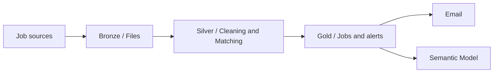
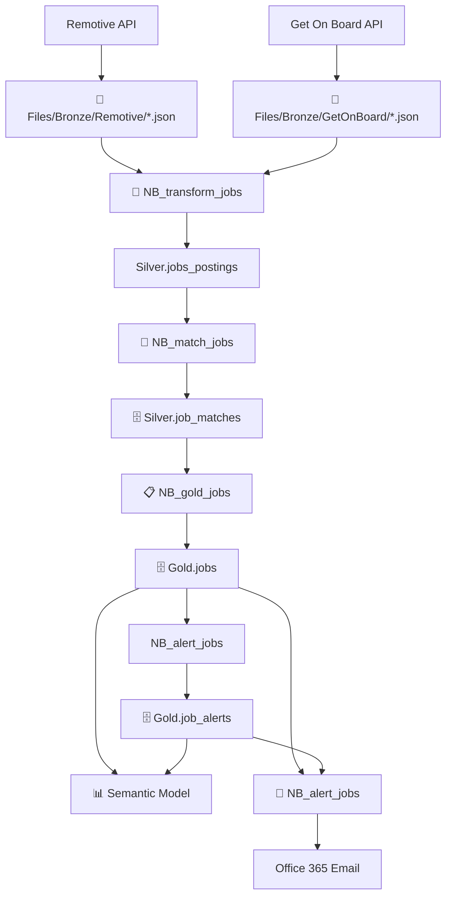

# 💼 Fabric Job Intelligence Alert

Plataforma de inteligencia de empleo construida en **Microsoft Fabric** para ingerir ofertas desde múltiples fuentes, normalizarlas en un Lakehouse medallion, calcular relevancia para perfiles Data/AI/Analytics y generar alertas automáticas por correo.

[](https://learn.microsoft.com/fabric/)
[](https://powerbi.microsoft.com/)
[](https://spark.apache.org/docs/latest/api/python/)
[](https://www.postgresql.org/docs/)
[](https://learn.microsoft.com/fabric/data-engineering/lakehouse-overview)
[](https://www.python.org/)
[](https://learn.microsoft.com/fabric/data-engineering/lakehouse-overview)
[](https://learn.microsoft.com/fabric/data-factory/data-pipelines)


## 🎯 El Problema

Buscar ofertas de empleo en distintas fuentes es caótico:
- Formatos heterogéneos
- Duplicados abundantes
- Descripciones incompletas
- Campos inconsistentes
- Mucho ruido para identificar oportunidades reales

**La solución:** Una capa de inteligencia que captura, estandariza, prioriza y notifica automáticamente.


## 🏗️ Visión de la Solución



**Arquitectura Medallion:**
- 🔴 **Bronze**: Datos crudos de cada fuente
- 🟢 **Silver**: Estructuras unificadas, limpieza y relevancia
- 🟡 **Gold**: Tablas listas para consumo operativo y analítico

## 📂 Estructura del Repositorio

```text
Fabric-Job-Intelligence-Alert/
├── Sources Notebooks/
│   ├── NB_ingest_remotive.Notebook/
│   └── NB_ingest_getonboard.Notebook/
├── Silver Notebooks/
│   ├── NB_transform_jobs.Notebook/
│   └── NB_match_jobs.Notebook/
├── Gold Notebooks/
│   ├── NB_gold_jobs.Notebook/
│   └── NB_alert_jobs.Notebook/
├── LH_Medallion.Lakehouse/
│   ├── alm.settings.json
│   ├── lakehouse.metadata.json
│   └── shortcuts.metadata.json
├── PL_Master.DataPipeline/
│   ├── pipeline-content.json
│   └── .schedules
├── Jobs Semantic Model.SemanticModel/
└── README.md
```

| Componente | Responsabilidad |
|---|---|
| **Sources Notebooks** | Ingesta desde APIs externas hacia archivos en Bronze |
| **Silver Notebooks** | Normalización, limpieza, deduplicación, scoring |
| **Gold Notebooks** | Materialización de tablas finales y generación de alertas |
| **Lakehouse** | Almacenamiento medallion y configuración |
| **DataPipeline** | Orquestación end-to-end y lógica de envío |

## 🔄 Flujo de Datos


### Lectura del Flujo

**1️⃣ Ingesta**
- Consumo desde las fuentes Remotive y Get on Board en principio
- Persistencia como JSON para trazabilidad

**2️⃣ Transformación**
- Homogenización de columnas y estructuras
- Consolidación entre fuentes
- Eliminación de duplicados
- Limpieza de HTML

**3️⃣ Matching**
- Evaluación de: títulos, skills, descripción, ubicación
- Generación de `match_score`
- Filtro automático por relevancia
- Hash estable para identificar ofertas

**4️⃣ Gold**
- `Gold.jobs`: catálogo curado
- `Gold.job_alerts`: control de notificaciones

**5️⃣ Alertas**
- Selección de oportunidades pendientes
- Construcción de correo HTML
- Envío solo si hay nuevas vacantes

**6️⃣ Semantic Model**
- Capa semántica construida directamente sobre las tablas Gold
- Definición de relaciones
- Tablas listas para análisis y visualización en Power BI

## 🛠️ Tecnologías

| Tecnología | Rol |
|---|---|
| Microsoft Fabric Lakehouse | Almacenamiento unificado |
| Fabric Notebooks / PySpark | Ingesta y transformación |
| Delta Tables | Persistencia incremental |
| Fabric Data Pipeline | Orquestación |
| Fabric Semantic Model | Exposición de datos curados |
| Office 365 Connector | Envío de alertas |
| Python `requests` | Consumo de APIs |
| SQL | Esquemas y validación |

## 💡 Lógica de Negocio

### Criterio de Relevancia
El sistema asigna un `match_score` combinando:
- Coincidencia de título con perfiles objetivo
- Presencia de skills esperadas
- Correspondencia de ubicaciones
- Reglas de normalización aplicadas al texto

### Deduplificación
Consolidación y eliminación de duplicados antes de persistir. En Gold se usa `hash_id` para identificar ofertas de forma consistente.

### Control de Alertas
`Gold.job_alerts` evita reenvíos. El notebook de alertas procesa solo registros no enviados y marca el estado de envío.

### Limpieza de Contenido
Las descripciones se limpian de HTML y los campos se homogenizan para reducir fricción downstream.


## 📋 Implementación por Capa

### 🔴 Bronze (Sources)
**Notebooks:** `NB_ingest_remotive` | `NB_ingest_getonboard`

Consumen APIs externas, normalizan mínimamente y guardan JSON en:
- `Files/Bronze/Remotive/`
- `Files/Bronze/GetOnBoard/`

### 🟢 Silver (Transformación)
**Notebooks:** `NB_transform_jobs` | `NB_match_jobs`

Unifican esquemas, limpian contenido, calculan relevancia y escriben:
- `Silver.jobs_postings`
- `Silver.job_matches`

### 🟡 Gold (Publicación)
**Notebooks:** `NB_gold_jobs` | `NB_alert_jobs`

Materializan tablas listas para consumo:
- `Gold.jobs`
- `Gold.job_alerts`

## ⚙️ Orquestación (PL_Master)

El pipeline ejecuta en este orden (diariamente a las 08:00am):

1. Ingest From Get On Board
2. Ingest from Remotive
3. Transform Jobs
4. Match Jobs
5. Load Gold Jobs
6. Job Alerts

**Lógica final:**
- ✅ Si el notebook de alertas detecta nuevas vacantes, se envía un correo con las ofertas priorizadas.
- ⏭️ Si no hay empleos nuevos, también se envía un correo indicando explícitamente que no se encontraron vacantes nuevas.
- 🔀 El pipeline incluye una condición que evalúa la salida del notebook de alertas para decidir qué tipo de correo enviar.

## 🚀 Preparación para Replicarlo

### Requisitos Previos
- ✓ Workspace de Microsoft Fabric con permisos para Lakehouse, Notebooks, Pipeline
- ✓ Cuenta Office 365 para envío de correos

### Recursos a Crear
```
Lakehouse:  LH_Medallion
Pipeline:   PL_Master

Notebooks (6):
  ├── NB_ingest_remotive
  ├── NB_ingest_getonboard
  ├── NB_transform_jobs
  ├── NB_match_jobs
  ├── NB_gold_jobs
  └── NB_alert_jobs

Semantic Model: Jobs Semantic Model
```
### Configuración Necesaria
- Rutas del Lakehouse en notebooks
- Referencias a esquemas/tablas
- Conexión del conector Office 365
- Programación del pipeline
- Criterios de matching (según perfiles)

### Estructura del Lakehouse
```
Files/
  └── Bronze/
      ├── Remotive/
      └── GetOnBoard/

Schemas:
  ├── Silver.jobs_postings
  ├── Silver.job_matches
  ├── Gold.jobs
  └── Gold.job_alerts
```
## ✅ Validación

Una ejecución correcta muestra:

- 📁 Nuevos archivos JSON en Bronze
- 📊 Filas en `Silver.jobs_postings` y `Silver.job_matches`
- 📈 Registros en `Gold.jobs`
- 🔔 Control en `Gold.job_alerts`
- 📧 Correo HTML con vacantes priorizadas o indicando que no hay nuevas vacantes

## 📊 Estado del Proyecto

Base funcional completa: ingesta → transformación → scoring → persistencia → alertas.
Diseñado para ampliarse con nuevas fuentes sin romper el modelo medallion.

## 🎁 Resultado Final

Una plataforma que:
- 🔍 **Captura** datos de múltiples fuentes
- ⚙️ **Estandariza** campos y estructuras
- 📌 **Prioriza** ofertas por relevancia
- 📋 **Publica** tablas analíticas
- 📧 **Notifica** automáticamente las mejores oportunidades

## 🔍 Vistas del Proyecto
### Visualización en Power BI


### Workspace: **WS_JobPlatform** Lineage view


### Lakehouse: **LH_Medallion**


### Pipeline: **PL_Master**


### Semantic Model: **Jobs Semantic Model**


## 🧑‍💻 Autor

**Ramón Emilio López**
- **LinkedIn:** [ramón-emilio-lopez-57a833211](https://www.linkedin.com/in/ram%C3%B3n-emilio-lopez-57a833211/)
